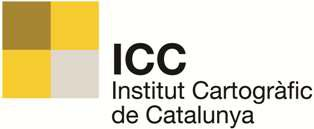
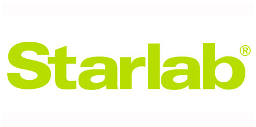

### Hi there 👋 I am Lucas Martínez Rodrigo (PhD) - I'm a FullStack Geospatial Scientist

### 🤝 Connect with me:

&nbsp;

---

### 📚 Education

 
 
 
 

### 💼 My professional career

 
 
 
 

---

### 📊 Analytics

### 🤖 Artificial Intelligence

### 💾 Databases

### 📚 Frameworks, Platforms and Libraries

### 💻 Spatial software

### ☁️ Hosting/SaaS

### 💻 IDEs/Editors

### 📋 Languages

### 🖥️ ML/DL

### 🎛️ Operating System

### 🕓 Version Control
.

### 💻 Virtualization - Other

